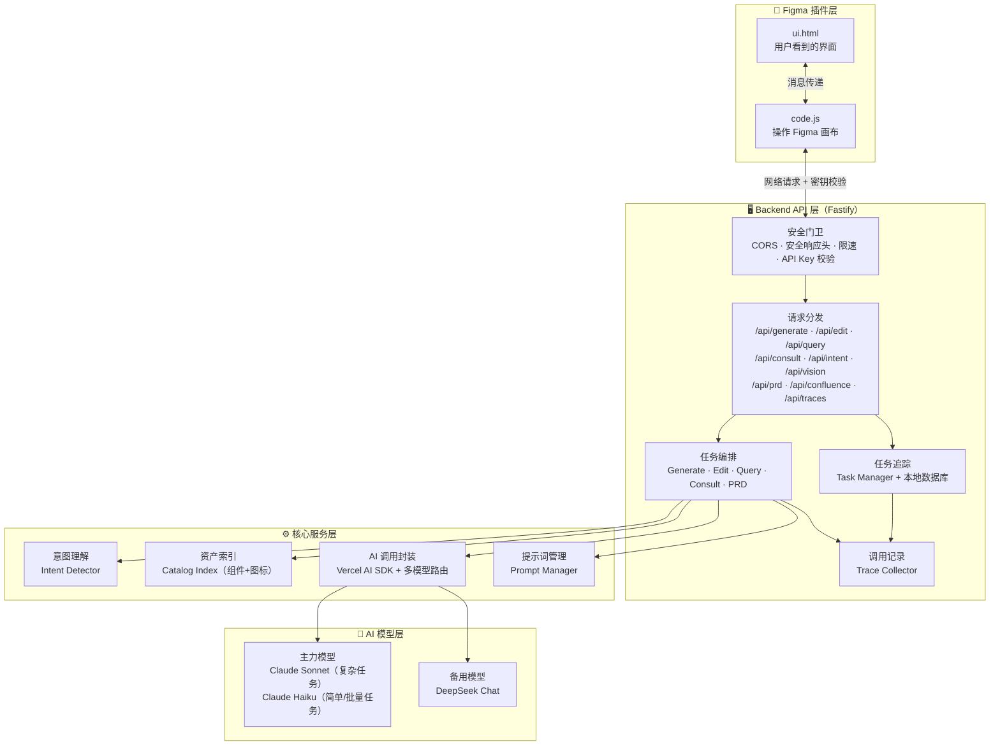
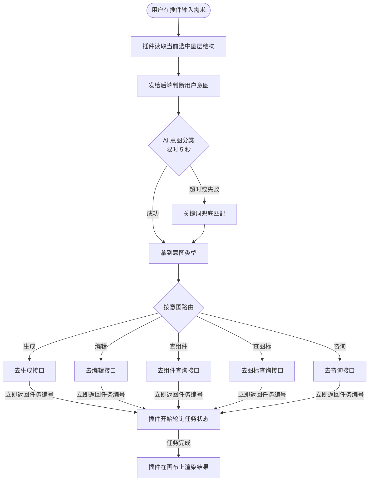
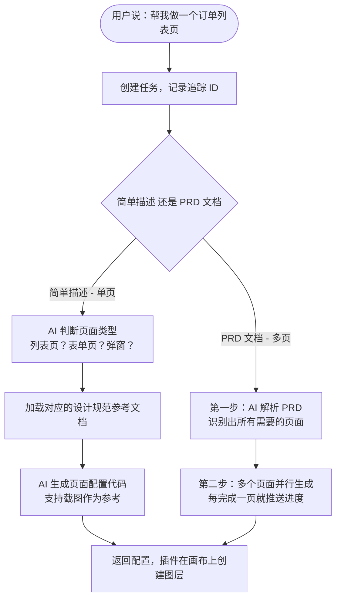
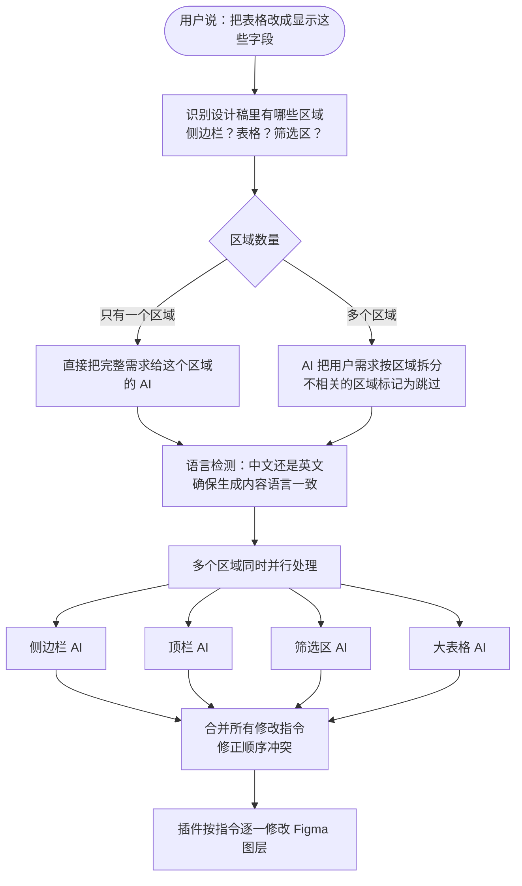
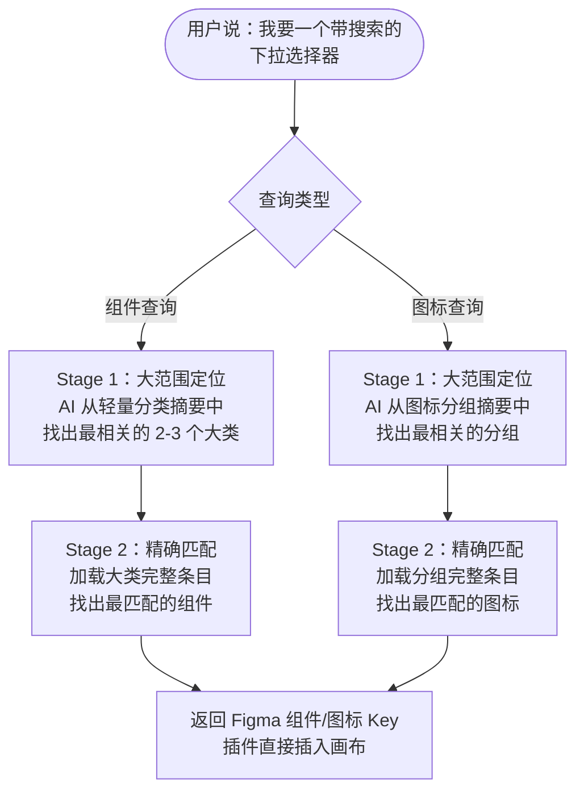
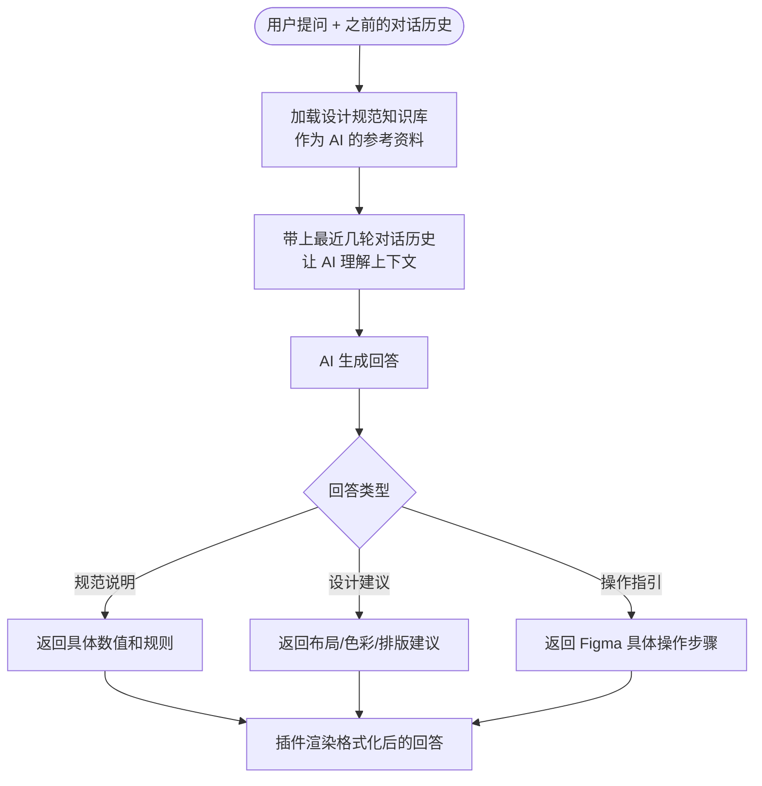
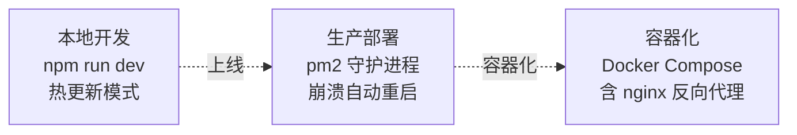

# Soda 项目介绍

> **Soda**（Shopee Open Design Agent）是为 Figma 设计师打造的 AI 智能助手插件。设计师只需用自然语言描述需求，就能自动生成 UI 页面、修改已有设计稿内容、查找组件和图标，或咨询设计规范。

---

## 一、项目概览

| 维度 | 说明 |
|------|------|
| 产品形态 | Figma 插件 + 独立 AI 后端服务 |
| 主要语言 | TypeScript（后端）/ JavaScript + HTML（插件） |
| 后端框架 | Fastify v5 |
| AI SDK | Vercel AI SDK v6（[ai](file:///Users/lemeng.shi/Downloads/Soda/Soda/soda-backend/src/index.ts#26-135) + `@ai-sdk/anthropic` / `@ai-sdk/deepseek` / `@ai-sdk/openai`） |
| AI 模型 | Anthropic Claude / DeepSeek / OpenAI 兼容接口 |
| 数据存储 | SQLite（`better-sqlite3`） |
| 部署方式 | PM2 进程管理 / Docker |

### 技术选型说明

**Fastify v5**
Fastify 是一个以高性能著称的 Node.js 后端框架，核心优势是极低的请求处理开销和原生的异步支持。选择它的原因是：Soda 的核心场景是大量并发的 AI 推理请求，每个请求都需要等待 LLM 返回（少则数秒、多则数十秒）。Fastify 的非阻塞架构确保在等待 AI 响应的同时，其他请求仍能被正常处理，不会互相堵塞。此外，Fastify 生态提供了开箱即用的 CORS、安全头、限速插件，减少了重复建设。

**Vercel AI SDK v6**
Vercel AI SDK 是目前最成熟的 TypeScript AI 应用开发库，核心价值是"屏蔽差异、统一接口"。Soda 同时接入了 Anthropic、DeepSeek、OpenAI 三家模型，如果各自维护对接代码，切换模型或新增 Provider 的成本极高。AI SDK 让这三家模型的调用方式完全统一，并原生支持"结构化输出"——强制 AI 按照预设的 JSON 格式返回，从根本上解决了 AI 输出格式不稳定的问题。

**SQLite（better-sqlite3）**
SQLite 是一种嵌入式数据库，直接以文件形式存在于服务器本地，无需独立部署数据库服务，运维成本几乎为零。Soda 选用它主要满足两个场景：任务状态持久化（防止服务重启后任务记录丢失）和 AI 调用 Trace 记录（供监控 Dashboard 读取）。这两个场景数据量适中、读写频率低，SQLite 完全胜任，同时 `better-sqlite3` 采用同步 API，与 Fastify 的异步模型协作更简单可控。

---

## 二、整体架构

---

## 三、各模块说明

### 3.1 Figma 插件层

这是用户实际使用的部分，运行在 Figma 客户端内。

| 文件 | 作用 |
|------|------|
| [ui.html](file:///Users/lemeng.shi/Downloads/Soda/Soda/plugin/ui.html) | 插件界面，包含聊天框、历史记录、设置面板 |
| [code.js](file:///Users/lemeng.shi/Downloads/Soda/Soda/plugin/code.js) | 插件的"执行手"：读取当前画布上选中的图层结构，把用户的请求发给后端，拿到结果后在画布上创建或修改图层 |
| [manifest.json](file:///Users/lemeng.shi/Downloads/Soda/Soda/plugin/manifest.json) | 插件的"身份证"：声明插件名称、权限（读取团队库、当前用户信息）和允许访问的网络地址 |

### 3.2 安全门卫层（中间件）

每个请求进入后端前都会经过层层校验：

### 3.3 意图理解（Intent Detector）

用户输入一句话后，系统先用 AI 判断"用户想做什么"，再路由到对应的处理逻辑。支持识别 5 种意图：

| 意图 | 用户说的话（举例） |
|------|--------------------|
| [generate](file:///Users/lemeng.shi/Downloads/Soda/Soda/soda-backend/src/routes/generate.ts#12-64) 生成新页面 | "帮我做一个用户列表页" |
| `edit` 修改现有设计 | "把表格第二列改成订单金额" |
| `query_component` 查找组件 | "我要一个带搜索的下拉选择器" |
| `query_icon` 查找图标 | "找一个表示删除的图标" |
| [consult](file:///Users/lemeng.shi/Downloads/Soda/Soda/soda-backend/src/routes/consult.ts#16-63) 设计规范咨询 | "按钮之间的间距应该用多少？" |

如果 AI 判断超时或失败，系统会用关键词匹配作为兜底（比如输入包含"图标"就走图标查询）。

### 3.4 任务编排层（Orchestrators）

AI 生成一个完整页面不是一步完成的，而是拆成多个步骤依次或并行执行。编排层负责指挥这些步骤：

| 编排器 | 负责的功能 |
|--------|-----------|
| `generate-orchestrator` | 页面生成——先检测页面类型，再生成配置代码 |
| `edit-orchestrator` | 内容编辑——识别设计稿里的各个区域，分头处理，最后合并结果 |
| `query-orchestrator` | 组件/图标检索——先缩小范围，再精确匹配 |
| `consult-orchestrator` | 设计咨询——维护多轮对话上下文 |
| `prd-orchestrator` | PRD 文档解析与多页生成协调 |

### 3.5 AI 子模块层（Sub Agents）

编辑设计稿时，不同区域由不同的专属 AI 模块负责：

| Sub Agent | 负责的区域 |
|-----------|-----------|
| `sidebar-agent` | 侧边栏菜单 |
| `topbar-agent` | 顶部导航栏 |
| `page-header-agent` | 页头标题区 |
| `query-filter-agent` | 查询筛选区 |
| `table-agent` | 普通表格 |
| `full-table-agent` | 大型业务表格（有特殊压缩处理） |

### 3.6 任务追踪（Task Manager + SQLite）

AI 生成页面最慢需要 30 秒以上，系统采用"先拿号后取餐"模式：

1. 用户发出请求 → 立刻返回一个**任务编号**（taskId）
2. 后端在后台处理，每完成一步更新进度
3. 插件每隔一秒拿着编号问"好了吗"，拿到结果后渲染到画布

任务状态同时保存在**内存**（快速读写）和 **SQLite 数据库**（防止服务器重启后状态丢失）。

> 服务器重启就像店员交班——如果订单只记在前任店员脑子里，你的单就丢了。SQLite 就是那本"订单记录本"，无论人员怎么换，记录都在。

### 3.7 资产索引（Catalog Index）

组件和图标的知识库以 **Markdown 文件**形式存储在 `prompts/catalogs/` 目录下，包含组件目录（`component-catalog.md`）和图标目录（`icon-catalog.md`）两份文件。

服务启动时系统会自动完成以下处理：
1. **解析**：逐行读取 Markdown，按 `## 分类名` 和 `### 条目ID` 的层级结构提取每个组件/图标的 ID、名称、描述等字段
2. **分组**：图标按语义规则（如"操作类"、"状态类"、"方向类"）自动归入对应分组，便于两阶段检索
3. **摘要生成**：为每个分类生成轻量摘要文本（约 1 行），作为 Stage 1 检索时的索引条目
4. **哈希缓存**：计算两份文件的 SHA-256 指纹，将解析结果序列化存入 `.cache/catalog-index.json`。下次启动时比对指纹——文件没变则直接读缓存，有变化才重新解析

> 就像整理好一份目录放在桌上，下次用不需要重新整理，除非目录内容改了。

**两阶段检索（Two-Stage Retrieval）**

组件/图标目录完整内容超过千行，如果每次查询都把全部内容传给 AI，Token 消耗极高，响应速度也慢。两阶段检索把"找东西"这件事拆成两步：

- **Stage 1（找大类）**：AI 只看每个分类的一行摘要（整个索引约 20～80 行），判断"用户要的大概是哪 2～3 个类别"——消耗极少的 Token
- **Stage 2（精确定位）**：只把那 2～3 个类别的完整条目展开，AI 从中挑出最匹配的具体组件或图标

整个**索引的构建过程完全不依赖 AI**——服务启动时用纯代码逐行解析 Markdown 文件，按 `## 分类名` 和 `### 条目ID` 的固定格式提取结构化数据，自动归组并生成摘要，全程无 Token 消耗，毫秒级完成。

### 3.8 AI 调用封装（LLM Client）

基于 **Vercel AI SDK** 的 `generateObject` 接口封装，统一管理所有 AI 调用：

- **多模型支持**：Anthropic Claude、DeepSeek、OpenAI 格式的模型，一套代码都能调
- **结构化输出**：用 Zod Schema 约束 AI 必须按格式返回 JSON，不合格自动重试
- **熔断保护**：某模型连续失败时，暂时停止调用它，防止雪崩
- **主备自动切换**：主模型（Claude）挂了，自动切 DeepSeek，用户无感知

### 3.9 调用记录（Trace Collector）

每次 AI 调用的详细信息（输入、输出、耗时）都会被记录，可通过 `/dashboard` 页面查看，用于排查问题和性能分析。

---

## 四、功能流程

### 4.1 核心路由：识别意图并分发

### 4.2 功能流程一：页面生成（Generate）

### 4.3 功能流程二：内容编辑（Edit）

### 4.4 功能流程三：组件/图标查询（Query）

### 4.5 功能流程四：设计规范咨询（Consult）

---

## 五、安全性设计

| 安全机制 | 通俗说明 |
|---------|---------|
| **来源白名单（CORS）** | 只接受来自 Figma 官方域名的请求，其他来源一律拒绝，防止被外部网站冒用 |
| **HTTP 安全响应头（Helmet）** | 在每个回复里自动加上"防护标签"，抵御常见 Web 攻击 |
| **请求限速（Rate Limit）** | 每分钟最多 60 次请求，超过暂时拒绝，防止恶意刷接口耗尽 AI 额度 |
| **API Key 认证** | 每个请求须在请求头携带正确密钥，就像门禁卡。`/health` 等监控接口除外 |
| **插件网络隔离** | Figma manifest 声明插件只能访问指定后端地址，无法访问其他网络 |
| **错误信息脱敏** | 生产环境出错时只返回"服务异常"，不暴露内部代码细节 |
| **任务取消机制** | 支持主动中止正在进行的 AI 调用，防止资源长时间占用 |

---

## 六、性能优化

### 6.1 "先拿号后取餐"的异步模式

AI 推理耗时较长（10～60 秒），请求进来立刻返回**任务编号**，后台慢慢处理；插件每隔一秒轮询状态，PRD 多页生成时每完成一页即推送进度，用户不用等全部完成才能看到结果。

### 6.2 大任务并行执行

| 场景 | 串行 | 并行 |
|------|------|------|
| PRD 含 5 个页面 | 共约 5× 时间 | 总耗时约等于 1 个页面的时间 |
| 设计稿含 4 个区域 | 侧边栏→顶栏→筛选区→表格，顺序等待 | 4 个区域同时交给各自 AI 处理 |

### 6.3 多级 AI 模型策略——贵的用对地方

| 模型角色 | 使用模型 | 理由 |
|---------|---------|------|
| 复杂任务编排 | Claude Sonnet | 理解复杂 PRD、规划多步骤，不能出错 |
| 批量子任务 | Claude Haiku | 结构固定、重复度高，轻量更快更省钱 |
| 意图判断 | Claude Haiku | 只需分类一个句子，极轻量 |
| 备用兜底 | DeepSeek | 主模型失败自动切换，用户无感知 |

### 6.4 组件目录哈希缓存

目录文件解析一次后缓存为 JSON，下次启动比对 SHA-256 指纹，文件未变则直接读缓存，不重复解析。

> 就像整理好的目录表放在桌上，内容没改就不用重新整理。

### 6.5 大表格"先压缩再处理"

编辑大型表格时，原始 Figma JSON 可能数万字符。系统做法：
1. 先压缩为"列结构摘要"（只含列名、列 ID 等关键信息）
2. AI 输出"修改意图"（改第几列、显示什么内容）
3. 程序将意图展开为具体操作指令

大幅减少 AI 输入和输出的 Token 消耗。

### 6.6 服务重启不失忆

SQLite 持久保存任务状态。服务器意外重启后：
- 进行中的任务标记为"已失败"，用户得到明确提示而非无限等待
- 已完成的任务结果仍可查询，不丢失
- 任务保留 30 分钟，过期自动清理

### 6.7 AI 调用可靠性保障

| 机制 | 作用 |
|------|------|
| **自动重试** | AI 返回格式不对时自动重试 |
| **熔断保护** | 某模型连续失败，暂停调用，防止雪崩 |
| **超时限制** | 意图识别限 5 秒，防止单个请求挂起服务 |
| **结构化输出校验** | Zod Schema 约束返回格式，不合格则重试 |
| **主备自动切换** | 主模型挂了自动切 DeepSeek |

---

## 七、节省 Token 的设计

Token 是调用 AI 的计费单位，同时也直接影响响应速度——传给 AI 的内容越多，等待时间越长、费用越高。Soda 在多个环节做了主动控制：

### 7.1 两阶段检索——只给 AI 看"目录"而非"全书"

组件/图标完整目录超过千行，每次查询全量传入不仅昂贵，还容易接近模型的输入上限。两阶段设计让 Stage 1 只消耗约 20～80 行摘要索引，Stage 2 只加载命中分类的局部内容，相比直接传全量目录，**Token 消耗降低 80% 以上**。

### 7.2 大表格压缩——从万字 JSON 到百字摘要

Figma 大型业务表格的原始图层 JSON 可能有数万字符，直接传给 AI 容易超出限制，且大量样式坐标等信息 AI 根本用不到。系统做法：
1. 先用代码把表格压缩为"列结构摘要"（只保留列名、列 ID、数据类型等关键信息）
2. AI 基于摘要输出"修改意图"（修改哪列、显示什么内容）
3. 程序将意图展开为完整操作指令

**输入 Token 减少约 90%，输出 Token 同步大幅降低。**

### 7.3 不相关区域直接跳过，不调用 AI

编辑时，系统先把用户需求按页面区域拆分，并为每个区域打上相关性标签：

- `relevance = high`：需要修改 → 派遣 AI 子模块处理
- `relevance = none`：用户没提到这个区域 → **直接跳过，零 Token 消耗**

一个只需要改表格的请求，不会触碰侧边栏、顶栏等无关区域的 AI 调用。

### 7.4 PRD 多页批量拆分——一次调用代替 N 次

当 PRD 涉及多个页面时，每次独立"需求拆分"都需要带上完整的 PRD 文本。系统改用批量模式：一次 LLM 调用处理所有页面的需求拆分，**节省 N-1 次 PRD 全文的 Token 消耗**。

**举个例子：** 一份 PRD 描述了订单列表页、订单详情页、创建订单页 3 个页面（PRD 全文 2000 Token）。

- **逐页拆分（旧）**：调用 3 次，每次都带上完整 PRD → 2000 × 3 = **6000 Token**
- **批量拆分（现）**：一次调用，把 3 个页面的拆分需求合并处理 → 2000 × 1 = **2000 Token**，节省 67%

### 7.5 轻量模型做轻量任务

不同任务对 AI 能力要求差异很大，不应一律使用最贵的模型：

| 任务 | 选用模型 | 节省逻辑 |
|------|---------|---------|
| 意图判断（仅分类） | Claude Haiku | 最大输出限制 32 Token，极省 |
| 子 Agent 批量执行 | Claude Haiku | 结构固定，不需要复杂推理 |
| PRD 解析 / 复杂编排 | Claude Sonnet | 质量优先，该花就花 |

### 7.6 限制最大输出长度

每类调用都明确设置输出上限（`maxOutputTokens`），防止模型"啰嗦"：

| 调用场景 | 输出上限 | 原因 |
|---------|---------|------|
| 意图检测 | 32 Token | 只需输出一个分类词 |
| 需求拆分 | 2048 Token | 结构化摘要，不需要太长 |
| CONFIG 生成 | 8192 Token | 允许完整的页面配置代码 |

### 7.7 索引缓存，构建过程不消耗 Token

Markdown 目录的解析和索引构建完全由代码完成（无 LLM），且结果在服务重启间复用（SHA-256 哈希缓存）。每次检索的 Stage 1 都能即时返回轻量索引，无需实时构建，保证了低延迟响应。

---

## 八、部署方式

